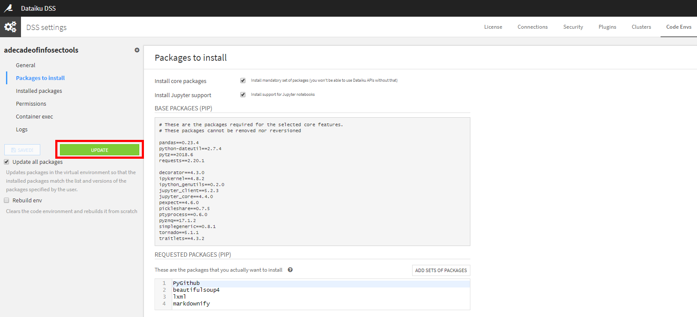
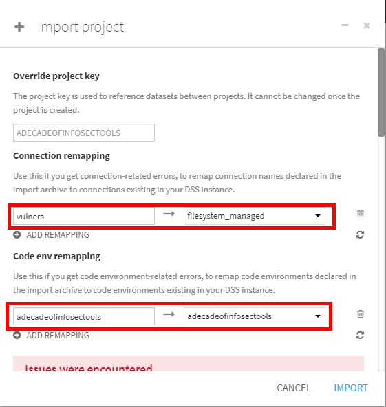
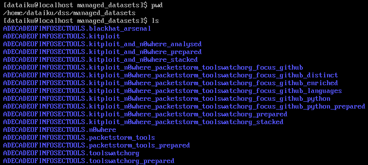
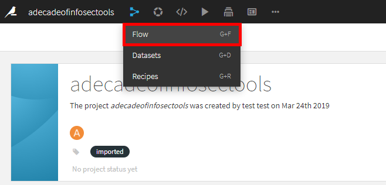
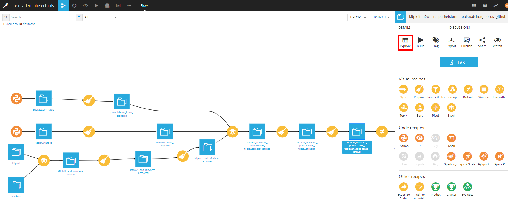

A decade of infosec tools
=========================

Tutorial
--------
The whole study has been achieved with the Dataiku Data Science Studio (DSS) Free edition.  
As a consequence, the study code and datasets are provided under a [Dataiku DSS project](../Dataiku%20DSS%20project).  
The following tutorial should help you setup the environment for you to be able to reproduce the study.  
  
  
## 1. Install Dataiku DSS
The first step is to install, if you don't already have it, Dataiku DSS.
It comes in [several forms](https://www.dataiku.com/dss/trynow/free-edition/) but this tutorial will be based on the `VirtualBox / VMWare` version.
So first, follow [these steps](https://www.dataiku.com/dss/trynow/virtualbox/): the system credentials are `dataiku` for login and password


2. Install Python 3.6 in the Dataiku DSS VM
-------------------------------------------
By default, only Python 2.7 is installed in the VM provided by Dataiku.
This study has been achieved with Python 3 code so for this step, in your VM, install Python 3.6:
```
$ sudo yum install python36
```


3. Import the custom code-environment
-------------------------------------
This study has been achieved with Python 3 and some external dependencies (`pygithub`, `lxml`, `markdownify`, `beautifulsoup4`) so a custom Dataiku `code-environment`, which is a regular Python `virtualenv`, has been created to package everything.  
* 1. `Administration` > `Code envs` > `Import env`
  
  
* 2. Click on `Select a file` and choose the [code-environment zip file provided here](../Dataiku%20DSS%20project/adecadeofinfosectools.zip)
* 3. Click on `Import`
* 4. Click on the imported code environment name `adecadeofinfosectools` > `Packages to install` > `Update`. It will download and install these dependencies.
  


4. (optional) Set Github credentials as environment variables
-------------------------------------------------------------
At one stage of the study, 2000+ github repositories have been analyzed, by collecting for each, a lot of metadata (stars, forks, watchers, commit dates, etc.).  
This stage has been achieved with the [`PyGithub`](https://pygithub.readthedocs.io/en/latest/introduction.html) external module, calling [Github API](https://developer.github.com/v3/).  
Facing Github [rate limit](https://developer.github.com/v3/rate_limit/) for API calls, I created 11 different accounts (with the same password :-)) to be able to process the 2000+ repositories asynchronously in 1 hour.
If you want to reproduce this study step, you will need to also provide account credentials, as system environment variables.
* `Administration` > `Settings` > `Variables`
  


5. Import the project
---------------------
1. Go the Dataiku homepage and select `Import project`
  
2. Choose the [project zip file provided here](../Dataiku%20DSS%20project/ADECADEOFINFOSECTOOLS_20190508.zip)
  
3. Remap `Connection`, which is the root file path of the project on the VM ; and the `Code-environment`, as is and then click on `Import`:
  

The `managed_datasets` folder is there on the Dataiku DSS VM, it contains all input, intermediate and output datasets:



6. Explore the project
----------------------
If you're reading this section, previous actions went well.
You now have the full project environment, you can start exploring data and code:




7. Going further with Dataiku DSS
---------------------------------
Take some time to read the [Dataiku DSS tutorials](https://academy.dataiku.com/latest/tutorial/basics/index.html) to handle that tool.